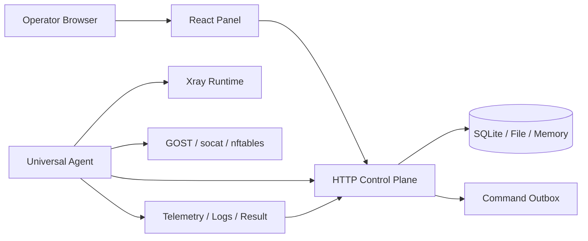

<p align="center">
  
</p>

<h1 align="center">OU-UI Next</h1>

<p align="center">
  自托管 Master / Agent 网关控制面板，面向 Xray 客户节点、端口转发、订阅分发、配额、审计和运行时验收。
</p>

<p align="center">
  <strong>V2.7.0</strong>
  ·
  <a href="README.en.md">English</a>
  ·
  <a href="README.zh-CN.md">中文旧版说明</a>
  ·
  <a href="docs/openapi/ou-ui-next-v1.yaml">OpenAPI</a>
  ·
  <a href="scripts/install-master.sh">Master 安装脚本</a>
  ·
  <a href="public/install/ou-agent.sh">Agent 安装器</a>
</p>

## 项目定位

OU-UI Next 是一个生产导向的 Master / Agent 网关运维控制面板。它把浏览器面板、HTTP Control Plane、持久化状态、任务审计、Agent command channel、Xray runtime、Forwarding runtime 和 Subscription delivery 串成一个可验证的闭环。

V2.0.0 立住了运行时闭环和能力边界。V2.1.0 把 Dashboard、提交反馈和空状态推进到“操作员每天能顺手使用”的方向。V2.7.0 继续把核心工作台从分散表格推进到可分诊、可复制、可跳转的运维入口：Xray 客户节点、Subscription delivery 和 Forwarding runtime 现在都能从真实状态生成 Operator Workbench。

当前版本的核心原则：

- **功能声明必须和 runtime 能力一致**：未落地到 Agent 的能力只能标记为 Preview、Blocked 或 Roadmap。
- **所有高风险操作必须有证据链**：task、command、preflight、runtime snapshot、Agent result、audit evidence 需要能互相解释。
- **Xray / Forwarding / Subscription 共享客户与配额语义**：到期、限额、禁用、流量倍率和订阅输出不能各说各话。
- **UI 是运维工作台，不是静态展示页**：关键路径必须有状态、下一步动作、复制诊断包和可恢复路径。

## V2.7.0 亮点

| 方向 | 变化 |
| --- | --- |
| Xray inbound / client | 支持结构化 `metadata.clients[]`、多 client runtime artifact、逐 client policy、逐 client share URI、listener 协议冲突拒绝、delete `remove_inbound` artifact |
| Agent evidence | Xray create/update/delete/client-action 进入 command lifecycle、config revision、preflight、snapshot、Agent result 和 release evidence 链路 |
| Forwarding / Tunnel | TCP/UDP/tcp+udp 转发、GOST/socat runtime、nftables 计数、端口冲突检查、计费流量 guardrail、规则级 runtime diagnosis |
| Subscription | Clash/Mihomo、sing-box、Shadowrocket、Stash、v2ray/URI 输出；公开订阅、最小客户门户、QR、token hash gate、导入/转换诊断、交付包和删除审计包 |
| UI / UX | V2.7.0 新增共享 Operator Workbench：Xray、Subscription、Forwarding 都从真实 summary/diagnosis/evidence 生成分诊项、跳转动作和安全诊断复制包；继续保留 Dashboard 分诊、状态中心、contextual action、inline diagnostics 和 runtime evidence drawer |
| 发布准备 | `package.json` 已更新为 `2.7.0`；`V2.0.0` tag 是上一版运行时基线，V2.7.0 当前不自动创建 tag |

## 功能矩阵

| 模块 | 状态 | 说明 |
| --- | --- | --- |
| Master 控制面板 | 已实现 | React + TypeScript + Vite，包含 dashboard、nodes、customer nodes、forwarding、subscriptions、tasks、audit、admin、telegram 等工作区 |
| HTTP Control Plane | 已实现 | `/api/v1` REST、SSE、Agent command/event、任务、审计、指标、CSRF/session、OpenAPI 和 smoke 流程 |
| Agent 注册与命令通道 | 已实现 | install token、runtime credential、command outbox、ACK/result/log_chunk、telemetry 上报 |
| Xray runtime apply | 已实现 | Agent 写入 Xray runtime profile，执行 config preflight，生成 snapshot，重启 runtime service，并回传 result evidence |
| Xray 多 client inbound | 已实现 | Control Plane artifact 支持多 client，UI/API/read model/runtime artifact 保留 quota、expiry、guardrail、traffic multiplier 证据 |
| Xray 协议 | 已实现 | runtime apply 支持 `vless`、`vmess`、`trojan`、`shadowsocks` |
| Hysteria2 / WireGuard / TUN | Preview | 可在订阅/领域概念中出现，但当前不是 Xray Agent runtime 的可下发生产协议 |
| Forwarding runtime | 已实现 | TCP/UDP/tcp+udp、GOST/socat、GOST 规则级限速、nftables 计数、端口冲突拒绝、quota guardrail、runtime diagnosis |
| Forwarding 高级控制 | Blocked by Agent runtime | `ipRateLimitMbps`、`maxConnections`、`maxConnectionsPerIp`、`proxyProtocol` 会作为 blocked diagnostics 保留，不作为已落地能力宣称 |
| Subscription mixer | 已实现 | 订阅身份、订阅源、导出 profile、公开输出、链接/QR、诊断、token preview / secure path 轮换 |
| Operator Workbench | 已实现 | Xray、Subscription、Forwarding 顶层分诊面板从真实 read model / runtime diagnosis / sync diagnosis 生成状态、动作和脱敏诊断包 |
| 用户订阅门户 | Preview | `/portal/{securePath}/{subId}` 提供最小客户门户；完整用户门户、设备绑定、泄露撤销仍在 Roadmap |
| SQLite 状态 | 已实现 | JSON-state SQLite 仓储 + schema v2 领域索引，适合单 Master 部署和当前安装器闭环 |
| 强 schema / HA | Roadmap | 完整关系模型、增量查询、多 Master/HA 还未完成 |

## 快速开始

推荐在干净的 Linux 服务器上安装 Master：

```bash
sudo bash -c 'bash <(curl -fsSL https://raw.githubusercontent.com/cshaizhihao/ou-ui-next/main/scripts/install-master.sh)'
```

如果当前已经是 `root`：

```bash
bash <(curl -fsSL https://raw.githubusercontent.com/cshaizhihao/ou-ui-next/main/scripts/install-master.sh)
```

安装完成后使用 `ou` CLI：

```bash
ou status
ou credentials
ou doctor
ou smoke
ou browser-smoke
ou backup-state
ou update
```

常见安装路径：

| 路径 | 用途 |
| --- | --- |
| `/opt/ou-ui-next` | 应用源码、构建产物和当前版本 |
| `/etc/ou-ui-next` | Master 环境变量、登录凭据、TLS 配置 |
| `/var/lib/ou-ui-next` | SQLite 状态、备份、验收包、归档 |
| `/var/www/ou-ui-next` | 前端静态文件 |
| `/etc/nginx/conf.d/ou-ui-next.conf` | Nginx 站点配置 |

## 开发启动

```bash
git clone https://github.com/cshaizhihao/ou-ui-next.git
cd ou-ui-next
npm install
npm run dev
```

启动真实 HTTP Control Plane：

```bash
npm run dev:control-plane
```

常用验证：

```bash
npm run typecheck
npm test
npm run build
```

本仓库用于实时评审的 `4174` 面板可以用本地部署脚本重启。脚本默认使用 `diagnostics/local-deploy/control-plane.sqlite`，不会切到空内存库；默认账号密码为 `admin/admin`，需要修改时设置 `OU_UI_LOCAL_4174_USERNAME` 和 `OU_UI_LOCAL_4174_PASSWORD`。本地评审部署默认给 backend transient unit 设置 `CPUQuota=30%`，给 static proxy 设置 `CPUQuota=15%`，并在启动前按 scope 压缩历史 traffic rollup，只保留最近样本，避免长时间评审库把 VPS CPU 打满；该压缩只影响本地诊断流量历史，不会删除 Agent、节点、任务、订阅或转发配置。

```bash
npm run build
npm run deploy:local-4174
npm run smoke:local-4174
```

公网同步验收：

```bash
OU_UI_LOCAL_4174_PUBLIC_URL=http://172.93.187.112:4174/ npm run smoke:local-4174
```

前端默认可以使用 mock API。需要连接真实 Control Plane 时设置：

```bash
VITE_CONTROL_PLANE_MODE=http
VITE_CONTROL_PLANE_BASE_URL=http://127.0.0.1:8787
```

## Control Plane / Agent 架构



Control Plane 负责保存意图、任务、审计链、read model 和 release evidence。Agent 负责在目标主机执行 artifact：写配置、preflight、应用、重启、采集 snapshot，再把 result、日志和 telemetry 回传给 Master。

核心链路：

1. Operator 在 UI/API 提交 Xray、Forwarding 或 Subscription 操作。
2. Control Plane 进行 schema、capability、端口冲突、guardrail 和权限校验。
3. Control Plane 生成 task、runtime artifact、config revision、preflight plan 和 command outbox。
4. Agent ACK command，执行 runtime apply / verify / rollback。
5. Agent 上报 result、log chunk、runtime snapshot 和 telemetry。
6. UI 在任务、工作台和 evidence drawer 中展示状态、失败阶段、原因和下一步动作。

## Xray 运行时

当前已落地：

- `vless`、`vmess`、`trojan`、`shadowsocks` inbound runtime artifact。
- TLS / Reality stream settings 编译。
- 多 client inbound artifact：`metadata.clients[]` 生成 Xray `settings.clients`、`clientPolicies[]` 和逐 client `subscription.shareUris[]`。
- 客户节点新增、编辑、启停、续期、加量、重置、删除操作进入 feature-level task input builder，保留 quota / expiry / guardrail / traffic multiplier 证据。
- 客户节点新增/编辑只允许选择具备 `xray` capability 的 Agent。
- API 会拒绝把人工 `inbound.*` 任务提交到缺少 `xray` capability 的已知 Agent。
- 同 Agent、同监听地址/端口但不同 runtime protocol 的 create/update 会在入队前以 `xray.port_conflict` 拒绝；同端口同协议可合并为多 client inbound。
- `runtimeDisabledByPolicy`、`quotaExceeded` 或 `clientExpired` client 会保留在 policy/diagnostics 中，但不会进入实际 Xray `settings.clients`。
- 自动 guardrail 任务会按 client 派生 disable / resume intent，避免一个客户的过期/超额影响共享 inbound 的其他客户。
- Delete artifact 输出 `remove_inbound`，并清空 active runtime clients。
- Xray preflight 失败时不会把 runtime 状态标记为成功。

当前不宣称生产完成：

- Hysteria2、WireGuard、TUN runtime apply。
- 3X-UI 级别的完整热 diff / hot reload 管线。
- 完整独立客户门户中的设备绑定、泄露撤销和套餐购买流程。

## Forwarding / Tunnel

当前已落地：

- TCP、UDP、tcp+udp 转发。
- GOST 优先，缺失时回退 socat。
- GOST 规则级 `rateLimitMbps`。
- nftables 计数采集，用于 forwarding telemetry 和 quota read model。
- pause / resume / delete 会停止或移除对应 systemd unit 和计数规则。
- create/update/redeploy 会在入队前检查同 Agent、同监听端口、协议重叠或通配监听地址重叠，冲突时返回 `forward.port_conflict`。
- runtime artifact 带出 `control-plane-compiled` diagnosis、planned service、blocked controls 和 next-action hints。
- UI 按规则、绑定、runtime service、计数样本、quota/guardrail 和 blocked controls 显示 `ready`、`waiting`、`degraded`、`blocked`、`failed`。
- waiting/degraded/blocked/failed 状态提供 runtime recovery panel；ready 状态也可以复制 runtime evidence 包。

当前 blocked controls：

- `ipRateLimitMbps`
- `maxConnections`
- `maxConnectionsPerIp`
- `proxyProtocol`

这些字段保留在领域模型与诊断包中，但不会作为 Agent 可执行配置提交。

## Subscription

当前已落地：

- 输出格式：URI、v2ray base64、Clash/Mihomo、sing-box、Shadowrocket、Stash。
- 外部订阅源导入、解析、同步状态和导出文件。
- 导入诊断：不兼容协议、字段缺失/无法解析、源规则过滤、同源去重、跨源重复、远程抓取失败。
- 公共订阅输出响应带出节点数、URI 转换数、未转换数和 conversion warning header。
- 公共订阅输出不会下发 operator disabled、runtime policy disabled、expired 或 over-quota 的本地 Xray client。
- 公共订阅下载区分 `subscription.quota_exceeded` 和 `subscription.runtime_disabled`。
- 链接抽屉支持门户链接、各格式链接、QR、复制诊断、交付包、删除审计包和公开路径 / token preview 轮换。
- `/portal/{securePath}/{subId}` 提供最小客户门户，展示启用格式链接、每格式 QR、到期、用量、生成节点、访问状态和 guardrail reason。
- 可选 `accessTokenHash` gate；HTTP task 可接收一次性 `metadata.accessTokenRaw` 并在入队前转换为 hash，JSON/SSE 响应会移除敏感 hash 字段。

后续重点：

- 完整客户门户。
- UI 一次性 raw token 展示/交付、泄露撤销和设备级绑定。
- 更完整的导入诊断报告：原始片段定位、格式转换 diff、节点修复建议。
- proxy group / rule provider 模板化。

## 环境变量

| 变量 | 用途 |
| --- | --- |
| `OU_UI_CONTROL_PLANE_HOST` | Control Plane 监听地址 |
| `OU_UI_CONTROL_PLANE_PORT` | Control Plane 监听端口 |
| `OU_UI_CONTROL_PLANE_STORAGE` | 存储模式，常用 `sqlite`、`file`、`memory` |
| `OU_UI_CONTROL_PLANE_SQLITE_FILE` | SQLite 状态文件路径 |
| `OU_UI_CONTROL_PLANE_OPERATOR_USERNAME` | 操作员登录用户名 |
| `OU_UI_CONTROL_PLANE_OPERATOR_PASSWORD` | 操作员登录密码 |
| `OU_UI_CONTROL_PLANE_OPERATOR_PASSWORD_HASH` | 生产推荐的登录密码 hash |
| `OU_UI_CONTROL_PLANE_OPERATOR_TOKEN` | 后端 operator bearer token |
| `OU_UI_CONTROL_PLANE_OPERATOR_SESSION_SECRET` | HttpOnly session secret |
| `OU_UI_CONTROL_PLANE_AGENT_TOKENS_JSON` | Agent install token 配置 |
| `OU_UI_COMMAND_ACK_TIMEOUT_MS` | Agent ACK 超时 |
| `OU_UI_COMMAND_RESULT_TIMEOUT_MS` | Agent result 超时，默认 `240000` |
| `OU_UI_TRAFFIC_ROLLUP_RETENTION_DAYS` | 流量历史保留天数 |
| `OU_UI_TRAFFIC_ROLLUP_MAX_RECORDS_PER_SCOPE` | 每个 Agent / 转发规则 / Xray client 的 rollup 保留上限 |
| `OU_UI_AGENT_LOG_RETENTION_DAYS` | Agent 日志保留天数 |
| `OU_UI_AGENT_LOG_MAX_EVENTS_PER_AGENT` | 每个 Agent 保留的命令日志事件上限 |
| `OU_UI_AGENT_LOG_CHUNK_PERSIST_EVERY` | Agent command log chunk 持久化采样间隔 |
| `OU_UI_SUBSCRIPTION_SOURCE_EGRESS_ALLOWLIST` | 订阅源出站 allowlist |
| `OU_UI_SYSTEM_ALERT_WEBHOOK_URLS` | 系统告警 webhook |
| `OU_UI_EXTERNAL_ARCHIVE_DIRECTORY` | 外部归档目录 |
| `VITE_CONTROL_PLANE_MODE` | 前端 API 模式，`mock` 或 `http` |
| `VITE_CONTROL_PLANE_BASE_URL` | 前端连接真实 Control Plane 的 base URL |
| `OU_UI_LOCAL_4174_USERNAME` | 本地 4174 部署的登录用户名 |
| `OU_UI_LOCAL_4174_PASSWORD` | 本地 4174 部署的登录密码 |
| `OU_UI_LOCAL_4174_PUBLIC_URL` | 4174 公网 smoke 使用的外部 URL |
| `OU_UI_LOCAL_4174_BACKEND_CPU_QUOTA` | 本地 4174 backend systemd CPUQuota，默认 `30%` |
| `OU_UI_LOCAL_4174_STATIC_CPU_QUOTA` | 本地 4174 static proxy CPUQuota，默认 `15%` |
| `OU_UI_LOCAL_4174_COMPACT_ROLLUPS_ON_START` | 是否在启动前压缩本地评审 traffic rollup，默认 `true` |
| `OU_UI_LOCAL_4174_TRAFFIC_ROLLUP_MAX_RECORDS_PER_SCOPE` | 本地评审每个 scope 保留的 traffic rollup 数，默认 `200` |

## 部署与验收

生产部署建议使用安装器生成的 `ou` CLI：

```bash
ou doctor
ou smoke -- --report /var/lib/ou-ui-next/acceptance/smoke.json
ou browser-smoke
ou backup-state
```

真实 Agent Xray apply 验证：

```bash
OU_UI_XRAY_SMOKE_BASE_URL=https://panel.example/ou-secure \
OU_UI_XRAY_SMOKE_USERNAME=operator \
OU_UI_XRAY_SMOKE_PASSWORD=... \
npm run smoke:xray-apply -- --agent-id agent-id --report /var/lib/ou-ui-next/acceptance/xray-apply-smoke.json

npm run smoke:xray-client-action -- --agent-id agent-id --report /var/lib/ou-ui-next/acceptance/xray-client-action-smoke.json
```

发布候选验收标准：

- `npm run typecheck` 通过。
- `npm run lint` 通过。
- `npm test` 或当前轮次相关测试通过。
- `npm run build` 通过。
- `npm run deploy:local-4174` 通过。
- `npm run smoke:local-4174` 或 browser smoke 通过。
- 4174 root / login / dashboard / snapshot / navigation 可访问。
- Smoke、Agent 日志、审计、归档和备份不输出明文 token、密码、cookie 或 CSRF。
- Xray / Forwarding / Subscription UI 不把 Preview/Blocked 能力显示为生产完成。

## 安全与权限

OU-UI Next 的安全边界：

- Operator session 使用 HttpOnly cookie，后端 operator token 不应进入前端 bundle。
- Agent install token 与 runtime credential 分离，审计只记录脱敏摘要。
- Agent event 必须同时匹配 `commandId`、`taskId` 和 `agentId`。
- 订阅源、告警 webhook、外部归档 webhook 默认拦截 localhost、私网、链路本地和组播目标。
- 公共订阅可选 token hash gate；HTTP JSON/SSE 响应会剔除 token hash 字段。
- 备份包生成阶段会剔除 `tokenHash`、`accessTokenHash` 和 `accessTokenRaw` 等敏感字段。

生产使用前必须完成：

- 替换默认账号和弱密码。
- 使用 HTTPS 和可信证书。
- 配置 session secret、operator token、Agent token。
- 定期备份 `/var/lib/ou-ui-next`。
- 对公网 webhook / 订阅源启用 allowlist。

## Roadmap

P0：

- 一等 Inbound / Client CRUD API，减少继续依赖通用 task metadata。
- Xray 多 client UI：批量导入、单 client 单独启停、单 client reset、共享 inbound 下的冲突和恢复体验。
- Forwarding blocked controls 如果要变为生产可用，需要补 Agent runtime、测试和 evidence。
- Subscription 客户门户从最小 HTML 升级为完整用户工作台。

P1：

- UI 一次性 raw token 展示/交付、泄露撤销、设备级绑定。
- Tunnel entry/exit、质量探测、故障切换和运行状态面板。
- 完整强 schema、增量查询和更高并发的 Control Plane 存储模型。
- 更接近 3X-UI 的 Xray hot diff / reload 管线。

P2：

- HA / 多 Master 策略。
- Provider 模板、rule provider、proxy group 编排。
- 商业化迁移工具、导入兼容报告和升级兼容报告。

## 参考项目

OU-UI Next 的产品方向参考了这些优秀项目：

- [3X-UI](https://github.com/MHSanaei/3x-ui)：Xray inbound/client、流量、订阅和运行时管理。
- [妙妙屋X](https://github.com/iluobei/miaomiaowuX)：Master/SubAgent、多服务器、远程部署、流量、证书、订阅、用户和诊断运维闭环。
- [Flvx](https://github.com/Sagit-chu/flvx)：Forwarding、tunnel、TCP/UDP、nftables runtime、诊断和节点状态管理。

OU-UI Next 不直接复制它们的架构，而是沿着 Master / Agent、任务审计、能力边界和 runtime evidence 的方向继续演进。
