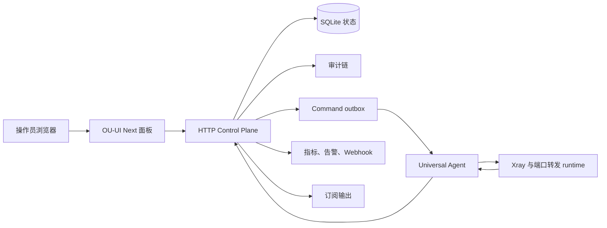

<p align="center">
  
</p>

<h1 align="center">OU-UI Next</h1>

<p align="center">
  面向商业化运营的自托管分布式网关控制面板。
</p>

<p align="center">
  <a href="README.en.md">English</a>
  ·
  <a href="docs/openapi/ou-ui-next-v1.yaml">OpenAPI</a>
  ·
  <a href="scripts/install-master.sh">安装脚本</a>
  ·
  <a href="public/install/ou-agent.sh">Agent 安装器</a>
</p>

## 🌟 项目定位

OU-UI Next 是一个面向生产运营的 Master 控制平面，用于集中管理 Universal Agent、客户节点、端口转发、订阅分发、配额策略、审计证据、Telegram 通知和生产验收流程。

它不是一个零散脚本集合，而是一个可以公开展示、可以交付客户、可以持续运维的商业化面板项目。你可以把它部署在自己的服务器上，用它管理多台受控主机和多类网络运行时，同时保留清晰的任务记录、权限边界和回滚证据。

适合这些场景：

- 🚀 自托管网关服务运营
- 🧑‍💼 客户节点、订阅身份和配额管理
- 🌐 多主机 Agent 纳管和运行时下发
- 🔁 TCP/UDP 端口转发和流量计费
- 📦 外部订阅源聚合、去重、过滤和导出
- 🔔 Telegram 客户自助和管理员通知
- 🧾 审计、备份、烟测和生产发布证据归档

## ⚡ 推荐安装方式

先看完上面的定位，再执行推荐安装命令。安装脚本会从 GitHub 拉取 `main` 分支，在服务器上构建前端和 SSR 控制面板，并写入 systemd、Nginx、SQLite 状态目录和管理命令。

```bash
sudo bash -c 'bash <(curl -fsSL https://raw.githubusercontent.com/cshaizhihao/ou-ui-next/main/scripts/install-master.sh)'
```

如果当前已经是 `root` 用户，可以直接运行：

```bash
bash <(curl -fsSL https://raw.githubusercontent.com/cshaizhihao/ou-ui-next/main/scripts/install-master.sh)
```

安装完成后，使用 `ou` 打开管理菜单，或直接运行常用命令：

```bash
ou credentials
ou status
ou doctor
ou smoke
ou browser-smoke
ou backup-state
ou update
ou fix
ou reconfigure
ou uninstall
```

安装脚本默认写入这些路径：

| 路径 | 用途 |
| --- | --- |
| `/opt/ou-ui-next` | 应用源码、构建产物和运行目录 |
| `/etc/ou-ui-next` | 后端配置、登录凭据和 SSL 证书 |
| `/var/lib/ou-ui-next` | SQLite 状态、备份、验收包和归档 |
| `/var/www/ou-ui-next` | 前端静态资源 |
| `/etc/nginx/conf.d/ou-ui-next.conf` | 面板 Nginx 站点 |

## 🧩 核心能力

OU-UI Next 把控制面板、后端服务、安装器和 Agent runtime 放在同一个产品闭环里。

| 模块 | 能力 |
| --- | --- |
| 🖥️ 控制面板 | 仪表盘、客户、主机、节点、转发、订阅、安全、调优、任务和审计工作区 |
| 🛰️ Universal Agent | 注册受控主机、轮询命令、应用运行时、上报 telemetry、ACK、result 和日志片段 |
| 🧬 客户节点 | 管理 VLESS、VMess、Trojan、Shadowsocks 和 Xray Reality 客户材料 |
| 🔁 端口转发 | 下发 TCP/UDP 转发、限速、暂停、恢复、配额和 runtime 健康探测 |
| 📦 订阅管理 | 同步外部订阅源、聚合节点库存、配置规则、生成客户输出和 provider export |
| 📊 配额和流量 | 按主机、客户节点、订阅用户、转发账号、链路和规则聚合使用量 |
| 🔐 安全策略 | 管理 Agent 凭证、操作员会话、权限 grant/revoke 和高风险确认 |
| 🧾 审计证据 | 记录任务状态、拒绝事件、运行时修订、凭证事件、烟测和验收包 |
| 🔔 通知系统 | Telegram 客户绑定、客户命令、管理员命令、投递重试和 dead-letter |
| 📈 可观测性 | 系统告警、SSE、Prometheus、JSON diagnostics、webhook 和生产 smoke |

## 🏗️ 架构概览

OU-UI Next 使用 Master-to-Agent 架构。Master 保存意图、策略和审计证据；Agent 在受控主机上应用运行时变更，并把结果回传到 Master。



默认部署使用 SQLite 存储控制面状态。安装器会创建 `ou`、`ou-ui`、`ouui` 和 `ou-ui-next` 管理命令，用于更新、修复、备份、恢复、烟测、验收和卸载。

## 🛡️ 安全设计

OU-UI Next 把操作员访问、Agent 凭证、订阅抓取、Webhook 投递和密钥输出都视为生产边界。

- 🔒 **操作员会话**：浏览器使用 HttpOnly session，变更类 API 需要 CSRF token
- 🧰 **自动化访问**：受保护 API 支持 bearer token，但不会把 token 写入前端 bundle
- 🛰️ **Agent 凭证**：install token 一次性使用，runtime credential 可轮换和撤销
- 🧾 **审计链**：敏感操作、拒绝事件、凭证事件和任务状态写入脱敏审计证据
- 🌐 **出站防护**：订阅源、Telegram、Webhook、外部归档和对象存储默认拦截本机和私网目标
- 🧼 **密钥脱敏**：doctor、smoke、日志、投递历史和审计路径不输出密码、token、proxy 密钥和完整订阅 URL
- ⚠️ **高风险确认**：删除、回滚、reload、quota reset 和权限撤销需要匹配风险确认数据

## 📦 订阅和客户运营

订阅工作区负责把本地 Xray 客户节点和外部 provider 节点整合成客户可用的输出。

支持能力包括：

- 外部订阅源同步、超时、体积限制、并发限制和每日预算
- 跨来源节点去重、状态标记和 provider 告警
- 按协议、地区、来源、主机、状态、客户和流量条件筛选
- 客户身份、订阅规则、导出配置和 provider 文件管理
- Clash、Sing-box 和 share-link 格式输出
- `subscription-userinfo` 流量头解析
- 配额超限后的订阅响应保护

## 🤖 Telegram 运营

Telegram 模块把客户自助和管理员告警接入控制面，同时避免把 bot token 暴露给前端。

支持流程：

- Bot API、webhook、long polling 和 proxy 配置
- 一次性绑定码和客户聊天绑定
- 客户命令：状态、流量、订阅、节点、到期、通知开关
- 管理员命令：系统状态、活动告警、配额、到期客户、搜索、测试投递、绑定列表
- 通知策略、投递历史、失败重试和 dead-letter
- token、proxy、webhook secret 和订阅 URL 脱敏

## 📈 生产验收和可观测性

OU-UI Next 内置面向现场交付的 smoke、acceptance 和 release evidence 流程。

常用验收命令：

```bash
ou doctor
ou smoke
ou browser-smoke
ou acceptance
ou final-acceptance
```

控制面还提供：

- `/api/v1/observability-metrics` 保护态 JSON 诊断快照
- `/metrics` Prometheus 指标
- `/events/v1/tasks` 任务事件流
- `/events/v1/system-alerts` 系统告警事件流
- 带 SHA-256 manifest 的备份、恢复和验收证据包
- Telegram、Webhook、外部归档和对象存储投递状态

## 🧑‍💻 本地开发

本地开发用于修改前端界面、HTTP Control Plane、mock adapter、安装器和 Agent installer。

```bash
npm install
npm run dev
npm run dev:control-plane
```

提交前建议运行：

```bash
npm test
npm run typecheck
npm run lint
npm run build
```

前端构建使用页面级 lazy loading 和稳定 vendor chunks。新增工作区页面时，优先保持页面组件可动态导入；新增大型第三方依赖时，检查 `vite.config.ts` 的 `manualChunks` 是否需要补充，避免重新生成超大的单一入口包。

移动端控制台使用手机优先的信息架构：小屏隐藏桌面侧栏，改用底部快捷导航；首页启动台采用横向任务卡，避免多模块纵向瀑布流堆叠。新增首页模块或工作区入口时，先确认 `<768px` 下仍保持单列内容、紧凑顶部栏和底部导航可达。

本轮 UI 改造落地了 P0-P7 的基础规范：共享 `ResponsivePage` / `ResponsiveSection` / `MobileMetricStrip` 组件承担移动端反瀑布约束；首页改为 KPI 优先的运营仪表盘；移动端底部导航扩展为核心五入口加“更多”；服务器/客户节点、端口转发、订阅中心首屏增加任务路径胶囊。后续新增复杂页面时，先复用这些响应式容器，再把高级配置放进抽屉、Tab 或横向任务路径，避免重新堆成长滚动卡片流。

视觉升级采用专业控制台蓝色系：以 `#2563EB` / `#0EA5E9` 作为主强调色，降低旧版霓虹玻璃噪音，统一面板、卡片、按钮、侧栏、顶栏和手机底部导航的 surface 层级。后续视觉调整优先改 token 与共享组件，不在业务页面里散落一次性 Tailwind 组合。

视觉系统从高噪音霓虹玻璃转向专业控制台风格：全局背景改为克制的蓝灰渐变，`island-panel` / `island-card` / `btn-glow` 使用更稳定的 surface、边框和阴影层级；侧栏、顶栏和移动底部导航统一蓝色选中态与轻量阴影。后续视觉升级优先调整共享 token 和壳层组件，再处理单页细节，避免页面级样式继续分叉。

主要目录：

```text
src/features        产品工作区页面
src/components      布局和通用 UI 组件
src/services/api    API 契约、HTTP adapter、指标、告警和订阅逻辑
src/server          服务化 Control Plane、仓储和生产入口
src/domain          Agent、任务、配额、订阅、审计和 runtime 模型
scripts             安装脚本、smoke、SQLite 工具和验收工具
public/install      Universal Agent 安装脚本
docs/openapi        OpenAPI 契约
docs/architecture   架构和生产验收说明
```

## 🧭 当前状态

OU-UI Next 当前定位为生产导向的自托管控制平面。项目已经包含安装自动化、SQLite 状态持久化、备份恢复、运行时 guardrail、凭证轮换、审计证据、Prometheus 指标和验收包生成。

在承载真实付费客户前，建议完成这些检查：

- 在干净 Linux 主机上运行安装脚本
- 保存 `ou doctor`、`ou smoke` 和 `ou browser-smoke` 输出
- 纳管至少一台 Agent 主机
- 下发一个测试客户节点和一个测试端口转发规则
- 配置并确认 Telegram 或 Webhook，只在需要时启用
- 使用 `ou backup-state` 创建备份
- 演练一次恢复流程

## 💼 商业化合作

这个仓库按公开商业项目方式展示。README 说明产品定位、部署模型、运营能力、安全边界和交付证据，便于评估是否适合你的基础设施。

可合作方向：

- 私有化部署评审
- 安装和上线支持
- 现有面板迁移
- 自定义 provider 接入
- 自定义订阅导出策略
- 企业安全审查
- 生产验收和发布证据流程定制

商业部署、集成或授权问题，请在 GitHub 仓库提交 issue。

## 📜 授权说明

当前仓库还没有 `LICENSE` 文件。公开可见不等于自动授权复制、再分发、二次销售或作为商业托管服务运营。

在维护者发布明确许可证之前，请把本项目视为 source-available 项目。公开分发、商用托管、市场打包、商业 fork 或再销售前，需要先确认授权条款。

## 🛣️ 路线图

近期路线图会优先服务公开发布和商业交付：

- 发布明确许可证和商业使用政策
- 增加 release tag 和发布说明
- 增加截图图库或在线演示
- 补充多主机生产拓扑文档
- 扩展常见 provider 模板
- 增加已有面板迁移指南
- 优化前端代码分包，降低大 chunk warning
- 补充高可用部署说明

## 🔗 项目链接

- GitHub：[cshaizhihao/ou-ui-next](https://github.com/cshaizhihao/ou-ui-next)
- English：[README.en.md](README.en.md)
- 一键安装脚本：[scripts/install-master.sh](scripts/install-master.sh)
- Agent 安装器：[public/install/ou-agent.sh](public/install/ou-agent.sh)
- OpenAPI：[docs/openapi/ou-ui-next-v1.yaml](docs/openapi/ou-ui-next-v1.yaml)
- 生产验收说明：[docs/architecture/v1-production-acceptance.md](docs/architecture/v1-production-acceptance.md)
