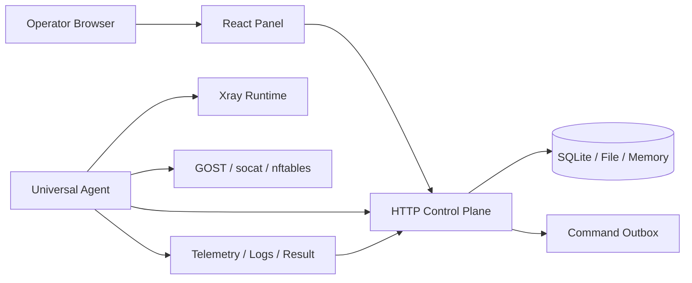

<p align="center">
  
</p>

<h1 align="center">OU-UI Next</h1>

<p align="center">
  自托管 Master / Agent 网关控制面板，面向 Xray 客户节点、端口转发、订阅分发、配额、审计和运行时验收。
</p>

<p align="center">
  <strong>V2.0.0</strong>
  ·
  <a href="README.en.md">English</a>
  ·
  <a href="README.zh-CN.md">中文旧版说明</a>
  ·
  <a href="docs/openapi/ou-ui-next-v1.yaml">OpenAPI</a>
  ·
  <a href="scripts/install-master.sh">Master 安装脚本</a>
  ·
  <a href="public/install/ou-agent.sh">Agent 安装器</a>
</p>

## 项目定位

OU-UI Next 是一个生产导向的分布式网关控制面板。它由浏览器面板、HTTP Control Plane、SQLite/File/In-memory 仓储、Universal Agent 安装器和 Agent runtime executor 组成，用来把操作员的配置意图变成可审计、可回滚、可验证的主机运行时状态。

V2.0.0 的重点不是继续增加页面数量，而是收紧“功能声明”和“真实运行时能力”的边界：

- Xray customer node 不再只按单 client 原型建模，runtime artifact 已支持 `metadata.clients[]` 编译为多 client inbound、逐 client policy 和逐 client share URI。
- Xray inbound create/update 的 `metadata.clients[]` 已进入 API contract / OpenAPI，Control Plane 会拒绝重复的 client identity、email 或 subscription rule。
- 客户节点 UI 发出的 Xray create/update 任务会同时携带结构化 `metadata.clients[]`，顶层 client 字段仅作为兼容层，并保留配额、到期、guardrail 和流量倍率证据。
- Xray inbound read model 合并 update 任务时会优先采用任务里显式提交的 client policy evidence，避免恢复/启用操作被旧 guardrail 状态覆盖。
- Xray inbound delete artifact 会生成 `remove_inbound`，并强制清空 runtime `settings.clients`，避免删除任务仍携带 active client evidence。
- 客户节点删除流程会在 `inbound.delete` 入队成功后同步入队绑定订阅身份的 `subscription.delete`，避免残留可访问的 public subscription identity。
- 客户节点新增/编辑表单只允许选择具备 `xray` capability 的 Agent；没有 Xray runtime 能力的主机不会作为可落地目标提交。
- Mock API 和 service-backed API 会拒绝把人工 `inbound.*` 任务提交到缺少 `xray` capability 的已知 Agent，并返回 `agent_runtime_capability.unsupported`；系统自动 guardrail 任务基于既有 inbound 放行。
- Xray inbound create/update 会在入队前检查同 Agent、同监听地址/端口的协议冲突；同端口同协议继续合并为多 client inbound，不同 runtime 协议会以 `xray.port_conflict` 拒绝。
- Agent 的 Xray profile 读取已兼容 `clientPolicies[]`，流量采集和 guardrail 评估可以逐 client 展开。
- Forwarding artifact 和工作区会显式声明 Agent runtime 已支持和未支持的控制项；artifact 会携带编译期 runtime diagnosis，规则行会展示 ready / waiting / degraded / blocked / failed 诊断，避免把 `proxyProtocol`、IP 级限速或连接数限制误写成已完整落地。
- Forwarding create/update 和 tunnel create/update/redeploy 在任务入队前会检查已存在规则和进行中的端口转发任务，拒绝同 Agent、同监听端口、重叠协议或通配监听地址的冲突绑定。
- README 按已实现、Preview、Roadmap 分层描述，未完成能力不会再包装成生产完成项。

## V2.0.0 亮点

| 方向 | V2.0.0 变化 |
| --- | --- |
| Xray inbound | 支持多 client artifact、逐 client policy、逐 client share URI、UI/API 结构化 `clients[]` 校验、listener 协议冲突拒绝、delete remove artifact、Xray config preflight、systemd runtime restart |
| Client guardrail | Agent profile 读取支持 `clientPolicies[]` 展开，配额和过期策略可以按 client 评估 |
| Forwarding runtime | TCP/UDP/tcp+udp 转发、GOST 规则级限速、nftables 计数继续保留；forward/tunnel 入队前检查端口绑定冲突；未实现控制项进入 runtime capability 状态；artifact 和规则行展示运行时诊断和下一步动作 |
| 订阅输出 | 保留 URI、v2ray、Clash/Mihomo、sing-box、Shadowrocket/Stash 等输出链路；订阅身份和导出配置都可选择 public output formats，并支持访问凭据轮换 |
| 发布准备 | 项目版本更新为 `2.0.0`，README 重写，能力边界更准确 |

## 功能矩阵

| 模块 | 状态 | 当前说明 |
| --- | --- | --- |
| Master 控制面板 | 已实现 | Vite + React + TypeScript，包含 dashboard、nodes、forwarding、subscriptions、tasks、audit、admin、telegram 等工作区 |
| HTTP Control Plane | 已实现 | `/api/v1` REST、SSE、Agent command/event 通道、权限、审计、任务、指标和 smoke 流程 |
| Agent 注册与命令通道 | 已实现 | install token、runtime credential、command outbox、ACK/result/log_chunk、telemetry 上报 |
| Xray runtime apply | 已实现 | Agent 写入 `inbounds.d`、合并同端口同协议 inbound、入队前拒绝同监听端口不同协议冲突、生成 `config.json`、执行 Xray preflight、重启 `ou-ui-xray.service` |
| Xray 多 client inbound | 已实现 | Control Plane artifact 支持 `clients[]`，API/OpenAPI 校验多 client metadata，Agent profile 支持逐 client telemetry/guardrail |
| Xray 协议 | 已实现 | runtime apply 支持 `vless`、`vmess`、`trojan`、`shadowsocks`；客户节点工作台和全局 quick actions 按同一 runtime protocol 边界过滤 |
| Hysteria / WireGuard / TUN | Preview | 域模型和订阅解析可出现相关概念，但当前不是 Xray Agent runtime 的生产落地协议，不会作为可编辑客户节点 runtime 入站暴露 |
| Forwarding runtime | 已实现 | TCP/UDP/tcp+udp，GOST/socat 执行，GOST 规则级限速，nftables 计数，forward/tunnel 端口绑定冲突拒绝，artifact / 规则级 runtime diagnosis |
| Forwarding 高级控制 | Preview | `ipRateLimitMbps`、`maxConnections`、`maxConnectionsPerIp`、`proxyProtocol` 会标记为 Agent runtime blocked，不宣称已完成 |
| Subscription mixer | 已实现 | 订阅身份、源导入、格式输出、provider/export/profile 工作区，支持订阅诊断、访问凭据轮换、二维码和 Shadowrocket/Stash 输出 |
| 用户订阅门户 | Preview | `/portal/{securePath}/{subId}` 提供最小客户门户，展示启用格式链接、到期、用量和生成节点；带 `accessTokenHash` 的身份会要求 raw token；独立客户门户、泄露撤销和设备级绑定仍需继续补齐 |
| SQLite 状态 | 已实现 | 当前为 JSON-state SQLite 仓储 + schema v2 领域实体索引表，适合单 Master 部署、安装器闭环和后续强 schema 迁移起步 |
| 规范化生产数据库 | Roadmap | Inbound/client/traffic/audit/outbox 的完整强 schema、增量查询和 HA 仍是后续重点 |

## 快速开始

推荐在干净的 Linux 服务器上使用安装脚本部署 Master：

```bash
sudo bash -c 'bash <(curl -fsSL https://raw.githubusercontent.com/cshaizhihao/ou-ui-next/main/scripts/install-master.sh)'
```

如果当前已经是 `root`：

```bash
bash <(curl -fsSL https://raw.githubusercontent.com/cshaizhihao/ou-ui-next/main/scripts/install-master.sh)
```

安装完成后使用管理命令：

```bash
ou status
ou credentials
ou doctor
ou smoke
ou browser-smoke
ou backup-state
ou update
```

常见安装路径：

| 路径 | 用途 |
| --- | --- |
| `/opt/ou-ui-next` | 应用源码、构建产物和当前版本 |
| `/etc/ou-ui-next` | Master 环境变量、登录凭据、TLS 配置 |
| `/var/lib/ou-ui-next` | SQLite 状态、备份、验收包、归档 |
| `/var/www/ou-ui-next` | 前端静态文件 |
| `/etc/nginx/conf.d/ou-ui-next.conf` | Nginx 站点配置 |

## 开发启动

```bash
git clone https://github.com/cshaizhihao/ou-ui-next.git
cd ou-ui-next
npm install
npm run dev
```

启动真实 HTTP Control Plane：

```bash
npm run dev:control-plane
```

常用验证：

```bash
npm run typecheck
npm test
npm run build
```

前端默认可以使用 mock API。需要连真实后端时，配置：

```bash
VITE_CONTROL_PLANE_MODE=http
VITE_CONTROL_PLANE_BASE_URL=http://127.0.0.1:8787
```

## 架构



Control Plane 保存意图、任务、审计链和 read model。Agent 负责在受控主机上执行 artifact：写配置、preflight、应用、重启、采集状态，再把 result、日志和 telemetry 交回 Master。

## Xray 运行时说明

当前 Agent runtime 支持这些落地能力：

- `vless`、`vmess`、`trojan`、`shadowsocks` inbound artifact。
- TLS / Reality stream settings 编译。
- 多 client inbound artifact：`metadata.clients[]` 会生成 Xray `settings.clients`、`clientPolicies[]` 和 `subscription.shareUris[]`。
- 客户节点新增、编辑、启停、续期、加量等 UI 操作会提交结构化 `metadata.clients[]`，并保留 quota / expiry / guardrail / `trafficMultiplier` 证据。
- read model 会优先应用 update task 中显式提交的 quota / expiry / guardrail 状态，旧遥测计数仍保留，但不会阻止恢复后的 policy 状态刷新。
- 客户节点删除会同步入队绑定订阅身份删除；历史手工创建的订阅身份如果无法从客户节点 metadata 推导，仍需在订阅工作区独立清理。
- 客户节点创建目标会按 Agent `xray` capability 过滤，没有 Xray runtime 的主机不会出现在可提交目标里。
- API 层会拒绝已知非 Xray Agent 的人工 inbound 任务，避免绕过 UI 后制造不会落地的 Xray runtime 任务。
- 客户节点工作台、全局 quick actions 和 runtime artifact 共用 `XRAY_RUNTIME_PROTOCOLS` 边界，当前只允许 `vless`、`vmess`、`trojan`、`shadowsocks` 进入可编辑/可下发 runtime inbound。
- 被 quota / expiry guardrail 标记为 `runtimeDisabledByPolicy` 的 client 会保留在 `clientPolicies[]` 和订阅诊断中，但不会进入实际 Xray `settings.clients`。
- 自动 guardrail 任务会按 client 派生 disable / resume intent，多 client inbound 不再因为共享一个 inbound 而整体跳过。
- 同端口同协议 inbound fragment 合并，保留独立 client profile。
- 同 Agent、同监听地址/端口但不同 runtime protocol 的人工 create/update 会在 Control Plane 入队前拒绝，返回 `xray.port_conflict`；`0.0.0.0` / `::` 等通配监听地址按重叠处理。
- Xray `StatsService` 计数采集、monthly reset、配额/过期 guardrail。
- `xray run -test` preflight，失败时不会把配置当作成功运行。

当前不应宣称生产完成的能力：

- Hysteria2、WireGuard、TUN 作为 Xray Agent runtime 尚未完成。
- 多 client 的 UI 编排和客户门户仍需要继续打磨。
- Xray 热更新目前以 systemd restart 收敛，不是 3X-UI 那种完整热 diff 管线。

## Forwarding / Tunnel 说明

当前 Agent runtime 支持：

- TCP、UDP、tcp+udp 端口转发。
- GOST 优先，缺失时回退 socat。
- 规则级 `rateLimitMbps`，支持 one-way / bi-directional 方向。
- nftables 计数采集，用于 forwarding telemetry 和 quota read model。
- 暂停、恢复、删除会停止或移除对应 systemd unit 和计数规则。
- Control Plane 会在 forwarding create/update 和 tunnel create/update/redeploy 入队前检查已存在规则和进行中的端口转发任务，命中同 Agent、同监听端口、协议重叠或通配监听地址重叠时返回 `forward.port_conflict`。
- Runtime artifact 会带出 `control-plane-compiled` 阶段的诊断、planned service 和 blocked controls，方便任务预览与后续 Agent evidence 对齐。
- 面板会根据规则、绑定、runtime service、计数样本、quota/guardrail 和 Agent blocked controls 显示 `ready`、`waiting`、`degraded`、`blocked`、`failed` 诊断，以及 apply / resume / repair / inspect 等下一步动作。

Preview / blocked 能力：

- `ipRateLimitMbps`
- `maxConnections`
- `maxConnectionsPerIp`
- `proxyProtocol`

这些字段仍保留在领域模型和 UI 数据结构中，但 V2.0.0 artifact 会把它们标记为 `blocked-by-agent-runtime`。后续要么补齐 GOST/nftables 实现，要么在 UI 中按 capability 禁用。

## Subscription 说明

当前已支持：

- URI、v2ray base64、Clash/Mihomo、sing-box、Shadowrocket、Stash 等输出。
- 外部订阅源导入、解析、同步状态和导出文件。
- 外部订阅源同步会报告不兼容协议、字段缺失或无法解析节点、源规则过滤、同源去重、跨源重复和远程抓取失败原因。
- 公共订阅输出响应会带出 `x-ou-ui-selected-node-count`、`x-ou-ui-converted-uri-count`、`x-ou-ui-unconverted-node-count` 和转换 warning 头，便于定位命中节点与实际可输出 URI 不一致的问题。
- 与 Xray client / customer node 的用量、到期、规则关联。
- 订阅身份和导出配置都可选择 public output formats，含 Shadowrocket / Stash。
- 订阅链接抽屉支持门户链接、二维码、复制各格式链接、`Subscription-Userinfo`、诊断文本和访问凭据轮换；轮换会生成新的 token preview 与 secure path，并重写该身份的公开订阅 URL。
- `/portal/{securePath}/{subId}` 提供最小客户门户 HTML，按当前订阅身份的启用输出格式展示链接、到期、用量和生成节点，并与公开订阅下载共享 `requestLimitPerHour` 限流桶。
- 公开订阅下载和门户支持可选 `accessTokenHash` 校验；配置该 hash 后，请求必须通过 `?token=`、`?access_token=` 或 `Authorization: Bearer` 提交匹配 raw token。HTTP task 创建/更新可接收一次性 `metadata.accessTokenRaw`，会在入队前转换为 `accessTokenHash` 并剔除 raw；HTTP JSON/SSE 响应会移除 `accessTokenHash` / `tokenHash` 字段。

后续重点：

- 完整独立用户订阅门户。
- UI 一次性 raw token 展示/交付、泄露撤销和设备级绑定。
- 更完整的导入诊断报告：原始文件片段定位、格式转换 diff、节点不兼容修复建议。
- proxy group / rule provider 模板化能力。

## 环境变量

| 变量 | 用途 |
| --- | --- |
| `OU_UI_CONTROL_PLANE_HOST` | Control Plane 监听地址 |
| `OU_UI_CONTROL_PLANE_PORT` | Control Plane 监听端口 |
| `OU_UI_CONTROL_PLANE_STORAGE` | 存储模式，常用 `sqlite`、`file`、`memory` |
| `OU_UI_CONTROL_PLANE_SQLITE_FILE` | SQLite 状态文件路径 |
| `OU_UI_CONTROL_PLANE_OPERATOR_USERNAME` | 操作员登录用户名 |
| `OU_UI_CONTROL_PLANE_OPERATOR_PASSWORD` | 操作员登录密码 |
| `OU_UI_CONTROL_PLANE_OPERATOR_PASSWORD_HASH` | 生产推荐的登录密码 hash |
| `OU_UI_CONTROL_PLANE_OPERATOR_TOKEN` | 后端 operator bearer token |
| `OU_UI_CONTROL_PLANE_OPERATOR_SESSION_SECRET` | HttpOnly session secret |
| `OU_UI_CONTROL_PLANE_AGENT_TOKENS_JSON` | Agent install token 配置 |
| `OU_UI_COMMAND_ACK_TIMEOUT_MS` | Agent ACK 超时 |
| `OU_UI_COMMAND_RESULT_TIMEOUT_MS` | Agent result 超时 |
| `OU_UI_TRAFFIC_ROLLUP_RETENTION_DAYS` | 流量历史保留天数 |
| `OU_UI_AGENT_LOG_RETENTION_DAYS` | Agent 日志保留天数 |
| `OU_UI_SUBSCRIPTION_SOURCE_EGRESS_ALLOWLIST` | 订阅源出站 allowlist |
| `OU_UI_SYSTEM_ALERT_WEBHOOK_URLS` | 系统告警 webhook |
| `OU_UI_EXTERNAL_ARCHIVE_DIRECTORY` | 外部归档目录 |
| `VITE_CONTROL_PLANE_MODE` | 前端 API 模式，`mock` 或 `http` |
| `VITE_CONTROL_PLANE_BASE_URL` | 前端连接真实 Control Plane 的 base URL |

## 部署与验收

生产部署建议使用安装器生成的 `ou` CLI 做运维入口：

```bash
ou doctor
ou smoke -- --report /var/lib/ou-ui-next/acceptance/smoke.json
ou browser-smoke
ou backup-state
```

验收重点：

- 面板可以登录，静态 bundle 不包含 operator token、session secret 或登录密码。
- `/api/v1/boundary`、受保护 API、SSE、metrics 和 CSRF 保护工作正常。
- 至少一台 Agent 已注册并能 ACK/result。
- Xray 或 Forwarding 任务必须有 Agent runtime evidence，不能人工直接 transition 为成功。
- Smoke 报告、Agent 日志、审计链和归档文件不得包含明文 token、密码、cookie 或 CSRF。
- 控制面备份包会在生成阶段剔除 `tokenHash`、`accessTokenHash` 和 `accessTokenRaw` 等敏感字段，避免只靠导出后 preflight 才发现泄露。

## 安全与权限

OU-UI Next 的安全边界包括：

- Operator session 使用 HttpOnly cookie，后端 operator token 不应进入前端 bundle。
- Agent install token 与 runtime credential 分离，审计只记录脱敏摘要。
- Agent event 必须同时匹配 `commandId`、`taskId` 和 `agentId`。
- 订阅源、告警 webhook、外部归档 webhook 默认拦截 localhost、私网、链路本地和组播目标。
- 日志、导出、smoke 和归档流程默认避免输出 secret。

生产使用前仍建议完成：

- 替换默认账号和弱密码。
- 使用 HTTPS 和可信证书。
- 配置 session secret、operator token、Agent token。
- 定期备份 `/var/lib/ou-ui-next`。
- 对公网 webhook / 订阅源启用 allowlist。

## Roadmap

P0：

- 为 inbound/client 提供一等 CRUD API，而不是继续依赖通用 task metadata。
- UI 侧按 Agent capability 禁用或解释 preview 字段。
- Xray 多 client UI 工作流、批量 client 导入、client 单独启停和重置。
- Forwarding 的 proxy protocol、连接数限制、IP 级限速落地或彻底从可编辑表单中移除。

P1：

- 订阅门户、UI 一次性 raw token 展示/交付、泄露撤销和设备级绑定。
- Tunnel entry/exit、质量探测、故障切换和运行状态面板。
- SQLite v2 已提供可重建的领域实体索引表；完整强 schema、增量查询和 HA 仍需继续推进。
- 更接近 3X-UI 的 Xray hot diff / reload 管线。

P2：

- HA / 多 Master 策略。
- 更完整的 provider 模板、rule provider、proxy group 编排。
- 面向商业交付的导入迁移工具和升级兼容报告。

## 参考项目

OU-UI Next 的产品方向参考了这些优秀项目：

- [3X-UI](https://github.com/MHSanaei/3x-ui)：Xray inbound/client、流量、订阅和运行时管理。
- [妙妙屋X](https://github.com/iluobei/miaomiaowuX)：订阅、通知、用户、证书、脚本和多功能控制面经验。
- [Flvx](https://github.com/Sagit-chu/flvx)：Forwarding、tunnel、nftables runtime、诊断和节点状态管理。

本项目不会直接复制它们的架构，而是沿着 Master / Agent、任务审计和运行时 evidence 的方向继续演进。
