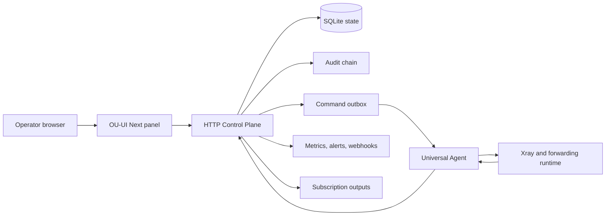

# OU-UI Next

OU-UI Next is a self-hosted control plane for distributed gateway operations. It manages Universal Agent enrollment, customer nodes, port forwarding, subscription delivery, quota enforcement, audit evidence, alerts, and production acceptance checks from one web panel.

The project is designed for operators who run multi-node network infrastructure and need a product-grade panel instead of a collection of shell scripts, spreadsheets, and one-off service files.

[GitHub repository](https://github.com/cshaizhihao/ou-ui-next)

## What OU-UI Next is

OU-UI Next turns a Linux host into a Master control plane. The Master deploys and supervises Universal Agents on managed hosts, compiles runtime artifacts for Xray and forwarding services, tracks customer usage, and records every high-risk operation as task and audit evidence.

It focuses on four operating goals:

- **Control**: manage hosts, customer nodes, forwarding rules, subscriptions, routing policies, and Telegram notifications from one panel
- **Accountability**: keep task history, audit-chain evidence, command outbox state, runtime revisions, and rollback context
- **Safety**: protect operator sessions, Agent credentials, outbound subscription fetches, webhook delivery, and secret handling
- **Deployment discipline**: install, update, repair, diagnose, back up, restore, smoke test, and uninstall through repeatable commands

## Who it is for

OU-UI Next fits teams and independent operators who need to run gateway infrastructure with visible operational controls:

- self-hosted network service operators
- reseller and customer-node administrators
- teams that need subscription aggregation and export management
- teams that need auditable runtime changes across Linux hosts
- operators who need production smoke tests and release evidence before customer traffic

OU-UI Next is not a hosted SaaS. You run it on your own server and keep control of credentials, runtime state, customer data, and audit records.

## Product capabilities

Each capability is available through the React control panel and the service-backed HTTP Control Plane.

| Area | What it does |
| --- | --- |
| Master control plane | Runs the web panel, protected APIs, operator sessions, task orchestration, audit chain, metrics, and installation CLI |
| Universal Agent | Enrolls Linux hosts, polls the Master, applies runtime artifacts, reports heartbeat, telemetry, command ACK, command result, and runtime logs |
| Managed hosts | Tracks Agent health, service health, latency, telemetry gaps, runtime versions, guardrail state, and recovery actions |
| Customer nodes | Manages Xray customer inbounds for VLESS, VMess, Trojan, and Shadowsocks, including Reality material and public share links |
| Port forwarding | Applies TCP and UDP forwarding rules, quota policies, pause and resume flows, and runtime health probes |
| Subscription management | Mixes local nodes and external subscription sources, filters by rules, builds provider exports, and exposes customer-specific outputs |
| Quota and billing windows | Aggregates usage for hosts, customer nodes, subscription users, forwarding accounts, links, and rules |
| Telegram operations | Handles customer binding, customer self-service commands, admin commands, policy updates, delivery retries, and notification history |
| Audit and evidence | Records sensitive operations, denial events, task transitions, runtime revisions, smoke results, and production acceptance bundles |
| Observability | Exposes dashboard alerts, Server-Sent Events, webhook notifications, JSON diagnostics, and Prometheus metrics |

## Architecture

OU-UI Next uses a Master-to-Agent model. The Master stores intent and policy. Agents apply runtime changes on each host and report evidence back to the Master.



The default deployment stores production state in SQLite and keeps generated artifacts on the host filesystem. The installer creates a management CLI so operators can repair, update, back up, restore, smoke test, and uninstall without editing system files by hand.

## Install the Master

Run the installer on a Linux server with root access and outbound access to GitHub and package repositories. The installer supports hosts with `apt`, `dnf`, or `yum`.

```bash
sudo bash -c 'bash <(curl -fsSL https://raw.githubusercontent.com/cshaizhihao/ou-ui-next/main/scripts/install-master.sh)'
```

If you already run as `root`, use the same script without `sudo`:

```bash
bash <(curl -fsSL https://raw.githubusercontent.com/cshaizhihao/ou-ui-next/main/scripts/install-master.sh)
```

The installer performs these actions:

- installs required system packages when missing
- installs Node.js 22 LTS when the host does not have a supported Node runtime
- builds the current GitHub `main` branch on the server
- writes the backend environment and frontend runtime configuration
- creates the `ou-ui-next-control-plane` systemd service
- writes the Nginx panel site
- generates the operator login credentials and secure panel path
- installs `ou-ui-next`, `ou-ui`, `ouui`, and `ou` management commands

The default install paths are:

| Path | Purpose |
| --- | --- |
| `/opt/ou-ui-next` | checked-out application source and build artifacts |
| `/etc/ou-ui-next` | backend configuration, credentials, and optional certificates |
| `/var/lib/ou-ui-next` | SQLite state, backups, acceptance bundles, archives, and npm cache |
| `/var/www/ou-ui-next` | deployed frontend static bundle |
| `/etc/nginx/conf.d/ou-ui-next.conf` | managed Nginx site |

## Manage an installed panel

The management CLI is the operational entry point after installation. Run `ou` to open the menu, or call commands directly.

```bash
ou credentials
ou status
ou doctor
ou smoke
ou browser-smoke
ou backup-state
ou restore-state /path/to/control-plane-backup.sqlite
ou update
ou fix
ou reconfigure
ou reset-state
ou uninstall
```

Use `ou credentials` to print the panel URL and operator login. Use `ou doctor` before and after production changes to check Nginx, service state, filesystem permissions, state storage, build fingerprints, browser smoke readiness, and credential health.

## Enroll managed hosts

After the Master is installed, create an Agent install command from the managed-host workflow in the panel. The command installs the Universal Agent on a target Linux host and registers it with a one-time install token.

The Agent installs its own CLI:

```bash
ou-agent status
ou-agent doctor
ou-agent update
ou-agent uninstall
```

The Agent can apply Xray and forwarding runtime artifacts, report telemetry, enforce runtime guardrails, rotate runtime credentials, send command results, and produce local acceptance evidence.

## Security model

OU-UI Next treats operator access, Agent credentials, subscription fetching, and outbound notification delivery as production boundaries.

- **Operator sessions**: browser access uses HttpOnly sessions with server-side session records and Cross-Site Request Forgery (CSRF) protection on mutating API calls
- **Bearer automation**: protected automation endpoints support bearer authentication without exposing tokens in logs or frontend bundles
- **Agent credentials**: install tokens are one-time credentials, runtime credentials can rotate, and audit records store only sanitized summaries
- **Audit evidence**: protected actions, denials, task transitions, credential events, and runtime changes append evidence to the control-plane audit chain
- **Outbound egress controls**: subscription source sync, Telegram delivery, alert webhooks, archive webhooks, and object-storage sinks block local and private targets by default
- **Secret handling**: doctor, smoke, delivery, and audit paths redact operator passwords, bearer tokens, bot tokens, webhook secrets, proxy credentials, and subscription URLs
- **High-risk confirmations**: delete, rollback, runtime reload, quota reset, and permission revoke operations require matching risk confirmation data

## Observability and release evidence

The control plane exposes operational state for humans and monitoring systems:

- dashboard snapshots for hosts, tasks, quotas, alerts, subscriptions, and runtime health
- Server-Sent Events for task status and active system alerts
- `/api/v1/observability-metrics` for protected JSON diagnostics
- `/metrics` for Prometheus scraping
- production smoke reports for HTTP, browser, Telegram, webhook, archive, and final acceptance flows
- backup manifests with SHA-256, storage mode, creation time, and source commit

Use smoke and acceptance commands before customer-facing changes:

```bash
ou smoke
ou browser-smoke
ou acceptance
ou final-acceptance
```

## Subscription operations

The subscription workspace combines local Xray customer nodes and external provider sources into customer-specific outputs.

It supports:

- external source sync with protocol, host, timeout, size, concurrency, and daily budget controls
- node inventory deduplication across sources
- identity-based subscription output for customers and groups
- rule filters by protocol, region, source, host, status, customer, and traffic condition
- provider export flows for Clash, Sing-box, and share-link formats
- quota-aware public subscription responses
- `subscription-userinfo` traffic header parsing and projection

## Telegram operations

The Telegram workspace connects the control plane to Bot API operations without exposing bot secrets in frontend responses.

Supported flows include:

- bot settings and webhook or long polling configuration
- customer binding with one-time challenge codes
- customer commands for status, traffic, subscription, nodes, expiry, and notification preferences
- admin commands for status, active alerts, quota, expiring customers, search, test delivery, and bindings
- retry and dead-letter handling for notification delivery
- delivery history with token, proxy, and subscription URL redaction

## Development

Use the local development setup when you want to work on the panel or HTTP Control Plane before deploying through the installer.

```bash
npm install
npm run dev
npm run dev:control-plane
```

Run the verification suite before submitting changes:

```bash
npm test
npm run typecheck
npm run lint
npm run build
```

The main project surfaces are:

```text
src/features        React product workspaces
src/components      shared layout and UI components
src/services/api    API contracts, HTTP adapter, metrics, alerts, subscriptions
src/server          service-backed Control Plane and repositories
src/domain          runtime, task, quota, subscription, Agent, and audit models
scripts             installer, smoke tests, SQLite tooling, acceptance tooling
public/install      Universal Agent installer
docs/openapi        OpenAPI contract
docs/architecture   architecture and production acceptance notes
```

## API contract

The public V1 control-plane contract lives at [docs/openapi/ou-ui-next-v1.yaml](docs/openapi/ou-ui-next-v1.yaml). The codebase validates API input with Zod, exercises the OpenAPI contract in tests, and keeps mock and service-backed adapters aligned for frontend development.

Key API surfaces include:

- `/api/v1/*` protected operator APIs
- `/agent/v1/*` Agent registration, polling, event, and credential rotation APIs
- `/events/v1/tasks` task event stream
- `/events/v1/system-alerts` system alert event stream
- `/telegram/webhook/{secret}` Telegram update ingress
- `/metrics` Prometheus metrics

## Production posture

OU-UI Next is built as a production-oriented self-hosted control plane. It includes installation automation, state persistence, backup and restore tooling, smoke tests, runtime guardrails, credential rotation, audit evidence, metrics, and acceptance bundle generation.

Before you use it for paid customer traffic:

- run the installer on a clean host
- save `ou doctor`, `ou smoke`, and `ou browser-smoke` output
- enroll at least one Agent host
- apply a test Xray customer node and a test forwarding rule
- confirm Telegram and webhook delivery only when you plan to use them
- create a backup with `ou backup-state`
- document your own restore procedure

## Commercial use

This repository is positioned as a commercial, public project. The public README explains the product, deployment model, operator workflows, and safety boundaries so evaluators can decide whether OU-UI Next fits their infrastructure.

Commercial collaboration can include:

- private deployment review
- hosted installation support
- custom provider integrations
- custom subscription export rules
- enterprise security review
- migration from existing panels
- dedicated acceptance and release evidence flows

Open a GitHub issue in this repository for commercial deployment, integration, or licensing discussions.

## License and source availability

This repository currently does not include a `LICENSE` file. Public source access does not grant automatic permission to copy, redistribute, resell, or operate OU-UI Next as a commercial service.

Treat the project as source-available until the maintainer publishes an explicit license. Confirm licensing terms before public redistribution, managed-service resale, marketplace packaging, or commercial forks.

## Roadmap

The near-term roadmap focuses on product hardening and public adoption:

- publish an explicit license and commercial usage policy
- add release tags and signed production artifacts
- add a hosted public demo or screenshot gallery
- document multi-host production topologies
- add provider templates for common subscription ecosystems
- expand migration guides for existing panels
- improve code splitting for smaller frontend bundles
- add high-availability deployment guidance

## Repository

- GitHub: [cshaizhihao/ou-ui-next](https://github.com/cshaizhihao/ou-ui-next)
- Installer: [scripts/install-master.sh](scripts/install-master.sh)
- Agent installer: [public/install/ou-agent.sh](public/install/ou-agent.sh)
- OpenAPI: [docs/openapi/ou-ui-next-v1.yaml](docs/openapi/ou-ui-next-v1.yaml)
- Production acceptance notes: [docs/architecture/v1-production-acceptance.md](docs/architecture/v1-production-acceptance.md)
